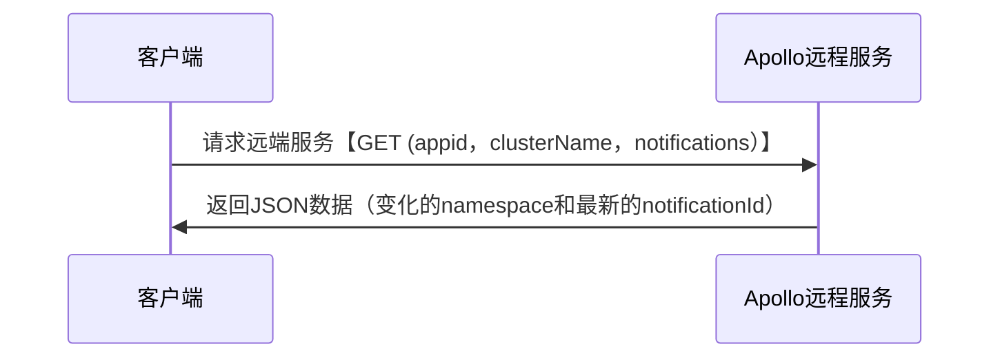
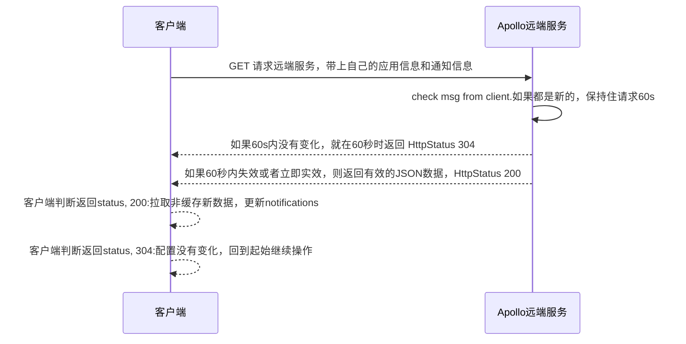

### 1. apollo_cpp概述

一个简单参数服务器apollo的cpp客户端，支持C++11。http-client库采用`cpprestsdk::cpprest`(使用该库之后就不需要额外引入json解析库以及http相关的库，可以简单满足；apollo客户端的相关http请求。支持阻塞与非阻塞调用以及超时等待，满足配置自动更新监测所需的相关API)，日志库使用了`spdlog`，为了解析`yaml`格式，引入了`libyaml-cpp0.6`。

- 安装依赖

```bash
# install cpprest and spdlog yaml-cpp
sudo apt-get install libcpprest-dev
sudo apt-get install libspdlog-dev
sudo apt-get install libyaml-cpp0.6
```

- 编译（默认编译sample)

开启了严格校验模式，会出现一些警告。

```bash
cd apollo_cpp
cmake -S . -B build -G "Ninja"
cmake --build build --target all
```

- 测试环境

环境为Ubuntu20.04

1、安装docker以及docker-compose:

```bash
# install docker
curl https://get.docker.com | sh
sudo systemctl start docker && sudo systemctl enable docker
# Manage Docker as a non-root user
sudo groupadd docker
sudo usermod -aG docker $USER
newgrp docker
# Configure Docker to start on boot with systemd
sudo systemctl enable docker.service
sudo systemctl enable containerd.service

# install docker-compose
sudo curl -L "https://github.com/docker/compose/releases/download/1.25.5/docker-compose-$(uname -s)-$(uname -m)" -o /usr/local/bin/docker-compose
sudo chmod +x /usr/local/bin/docker-compose
```

2、执行docker-compose

```bash
cd docker_env
docker-compose up -d
# 查看是否启动成功
docker logs -f apollo-quick-start
# Config service started. You may visit http://localhost:8080 for service status now!
# Portal started. You can visit http://localhost:8070 now!
```

3、使用数据卷容器迁移数据

TODO


### 2. apollo客户端获取配置与更新推送基本流程

#### 2.1 配置更新推送

配置与更新推送的本质是：发送http请求，解析返回的JSON数据，进行更新。

1、 基本请求与返回

基本请求：

```bash
URL: {config_server_url}/notifications/v2?appId={appId}&cluster={clusterName}&notifications={notifications}
Method: GET
```
2、基本流程图



3、配置更新图

在客户端存在一个持续请求的任务，该任务主要是为了定期从配置服务器中获取最新的配置信息。



4、返回JSON数据说明：

- 针对200OK，返回的JSON数据实例为：

```json
[
    {
        "namespaceName": "p1_pram_set",
        "notificationId": 16,
        "messages": {
            "details": {
                "cp1+default+p1_pram_set": 16
            }
        }
    },
    {
        "namespaceName": "p2_pram_set",
        "notificationId": 17,
        "messages": {
            "details": {
                "cp1+default+p2_pram_set": 17
            }
        }
    }
]
```

- 对于304，服务器会与客户端保持连接60s，然后返回304

- 如果其他错误，说明是请求的url格式有问题，注意传递参数需要使用url编码。[在线URL转换工具](https://tool.chinaz.com/tools/urlencode.aspx)

### 3. API设计

#### 3.1 接入需求

如何让c++的代码接入Apoll参数服务器 ，验证支持的参数类型：基本类型、嵌套、vector、list之类的。

answer:

目前apollo的版本是2.1.0，暂时只支持string类型的参数值，如果需要多个类型的需要自己解析字符串，然后拼接规则。
apollo已经有计划接入字段类型，但是还没有正式引入。具体[dis描述](https://github.com/apolloconfig/apollo/discussions/4716)。


#### 3.2 场景分析

一个自动驾驶的车辆，里面有很多工控机，每个工控机下有很多程序，每个程序都有它自己要关心的参数，如何去设计比较好。
1：以一个车为单位，如何管理这个车内所有工控机内程序的参数。
2：每个程序如何限制获取参数的权限，让它只能拿到程序关心的参数，而无法拿到其他程序的参数。
3：结合Apollo服务器的参数管理，是否可支持这种树状的参数管理。
4：对于不同的项目地，可能需要部署一个参数服务器，这个项目地下有多个车，而且这个项目地可能没有网络，如果有一些参数要更新（假设在北京更新），这个流程应该是怎么样的。

大概模型如下：

                 a car
            /		\        \
          / 		  \        \
        cp1		      cp2       cp3
        |    \     
        |      \
        p1      p2  ...
        |        |
    	|        |
    param set1  param set2
      /|\
       |
    |||||||
    apollo
- cp - 工控机
- p1 - 进程1
- param set1- 参数集

目前考虑有以下两种方式：

##### 方式1：

一个车就是对应一个应用。那么使用命名空间来区分不同工控机的不同进程的配置。

比如：

假设有一个车A，其应用名称为：app_car_a。

假设车A有三个工作控机Q、M、S。

假设Q下面有程序1，程序2，程序3；M下面有程序1，程序2，程序3；S下面有程序1，程序2，程序3。

那么在app_car_a应用下面就有9个命名空间。

```bash
appid: app_car_a,
namespace:[
      Q_process_1
      Q_process_2，
      Q_process_3，

      M_process_1，
      M_process_2，
      M_process_3，

      S_process_1，
      S_process_2，
      S_process_3，
]
```

##### 方式2：

一个车有多个应用，每车的每一个工控机对应一个应用。

假设有一个车B，它有以下三个工控机：Q、M、S。

每一个工控机下有一个多个程序1、2、3...

那么配置如下：

```bash
appid: app_car_b_Q,
namespace: [
    PROCESS_1
    PROCESS_2
    PROCESS_3
    ......
]

appid: app_car_b_M,
namespace: [
    PROCESS_1
    PROCESS_2
    PROCESS_3
    ......
]

appid: app_car_b_S,
namespace: [
    PROCESS_1
    PROCESS_2
    PROCESS_3
    ......
]
```
#### 3.3 properties格式的数据配置

详细示例：sample_public_ns.cpp

`apollo_mulns_client`结构中包含环境信息（每一个client与一个appid对应，每一个appid下有多个命名空间，每一个命名空间本质是一个配置文件）。

假设我们有两个appid：1、cp1；2、pubconfig。

其中，`cp1`表示某一台车的所有的应用配置文件的集合所对应的文件(每一个命名空间对应一个配置文件）：`cp1`有N个私有的命名空间，分别为`p1_pram_set`，`p2_pram_set`，.......。`p1_pram_set`的键值对被进程A(`process1_A`)使用，`p2_pram_set`的键值对被进程B(`processB`)使用。

此外还有一个公共的应用`pubconfig`，他的所有的命名空间都是`public`的，意味着所有的应用都可以访问该公共应用下的所有命名空间。比如：进程A在使用`cp1:p1_pram_set`配置的同时，还使用了`pubconfig:type1_public_config`的公共配置文件。图示如下：

```cpp
/**         
 *          explain:         
 * 
 *          1、cp1 app have two private namespace: p1_pram_set  p2_pram_set
 *          
 *          2、pubconfig app have multi public namespace(use pubconfig as the public config appid)
 * */

/**
 *                --- -- -- - cp1(APP) -- -- --  --
 *                           /                    \  
 *               /            \                   \
 *              /             \                    \
 *             /              \                     \
 *            /                \                      \
 *           /                  \                       \
 * 
 *    p1_pram_set(ns1)      p2_pram_set(ns2)             ns3...
 *          |                       |
 *          | have                  | have
 *         \|/                     \|/
 *     [key1:value1]           [key1:value1]     
 *     [key2:value2]           [key2:value2]
 *      ......                     ......
 *          |                         |
 *          |                         |
 *          |                         |
 *          |used by                  | used by
 *          |                         |
 *          |                         |
 *         \|/                       \|/
 *      process_A               process_B
 *          __                     __ 
 *         /\                       /\
 *           \                     /
 *            \                   /
 *             \                 /
 *              \               /
 *               \  can be use /
 *                \           /
 *                 \         /                          |
 *                  \       /                           |  
 *                   \     /                            | can be use
 *                    \   /                             |
 *                     \ /                              |
 * 
 *                  [key1: value1]                [key1: value1]
 *                  [key2: value2]                [key2: value2]
 *                  ......                          ......
 *                     /|\                           /|\
 *                      |  have                       | have
 *                      |                            |
 *                      |                           |
 * 
 *          type1_public_config(ns1)      type2_public_config(ns2)     
 *                   __                    __
 *                  |\                      /\
 *                    \                    /
 *                     \                  /                 
 *                      \                / 
 *          
 *                        pubconfig(public APP)
 * 
 * 
 * */
```

#### 3.4 yaml文件类型配置支持

新增了`apollo_client::apollo_mul_yaml_client`子类可以用于解析参数服务器上配置的`yaml`文件类型。具体示例见`sample_client_mul_yaml.cpp`。

```cpp
apollo_client::apollo_mul_yaml_client client;
//监听SampleApp下的default集群下的两个yaml命名空间配置。
client.init("http://localhost:8080", "SampleApp", "default", {"test_yaml.yaml", "test_yaml22.yaml"});
//可以使用getNsNameConfigNode接口获取配置。
 auto node = client.getNsNameConfigNode("test_yaml.yaml");
```

### 初步简单架构

每一个车仅有一个守护服务器与云参数服务器通信，维持长连接，更新参数信息。车内程序从守护服务器中获取参数。


### ref

[cpprest example](http://www.atakansarioglu.com/easy-quick-start-cplusplus-rest-client-example-cpprest-tutorial/)
