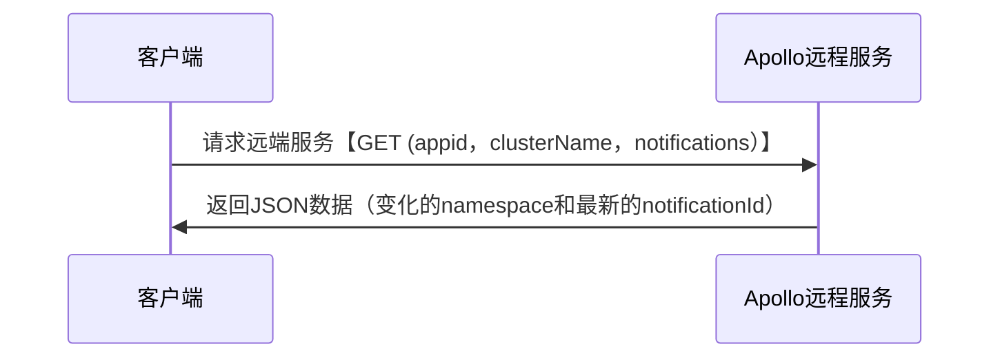
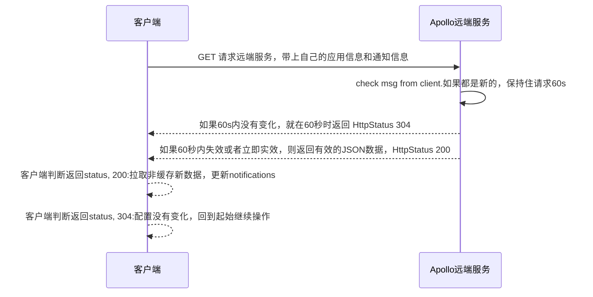

## apollo_cpp概述

一个简单参数服务器apollo的cpp客户端，支持C++11。http-client库采用`cpprestsdk::cpprest`.

[cpprest example](http://www.atakansarioglu.com/easy-quick-start-cplusplus-rest-client-example-cpprest-tutorial/)

## apollo

### 1.获取配置
```bash
GET
http://localhost:8080/configfiles/json/codereview/default/codereviwNS

```

## 配置更新推送

1、 基本请求与返回

基本请求：

```bash
URL: {config_server_url}/notifications/v2?appId={appId}&cluster={clusterName}&notifications={notifications}

Method: GET
```

返回JSON

```json
[
  {
    "namespaceName": "application",
    "notificationId": 101
  }
]
```




2、请求流程

在客户端存在一个持续请求的任务，该任务主要是为了定期从配置服务器中获取最新的配置信息。



## API设计

#### 接入需求

如何让c++的代码接入Apoll参数服务器 ，验证支持的参数类型：基本类型、嵌套、vector、list之类的。

answer:

目前apollo的版本是2.1.0，暂时只支持string类型的参数值，如果需要多个类型的需要自己解析字符串，然后拼接规则。
apollo已经有计划接入字段类型，但是还没有正式引入。具体[dis描述](https://github.com/apolloconfig/apollo/discussions/4716)。

#### 场景分析

一个自动驾驶的车辆，里面有很多工控机，每个工控机下有很多程序，每个程序都有它自己要关心的参数，如何去设计比较好。
1：以一个车为单位，如何管理这个车内所有工控机内程序的参数。
2：每个程序如何限制获取参数的权限，让它只能拿到程序关心的参数，而无法拿到其他程序的参数。
3：结合Apollo服务器的参数管理，是否可支持这种树状的参数管理。
4：对于不同的项目地，可能需要部署一个参数服务器，这个项目地下有多个车，而且这个项目地可能没有网络，如果有一些参数要更新（假设在北京更新），这个流程应该是怎么样的。

大概模型如下：

                 a car
            /		\        \
          / 		  \        \
        cp1		      cp2       cp3
        |    \     
        |      \
        p1      p2  ...
        |        |
    	|        |
    param set1  param set2
- cp - 工控机
- p1 - 进程1
- param set1- 参数集

目前考虑有以下两种方式：

##### 方式1：

一个车就是对应一个应用。那么使用命名空间来区分不同工控机的不同进程的配置。

比如：

假设有一个车A，其应用名称为：app_car_a。

假设车A有三个工作控机Q、M、S。

假设Q下面有程序1，程序2，程序3；M下面有程序1，程序2，程序3；S下面有程序1，程序2，程序3。

那么在app_car_a应用下面就有9个命名空间。

```bash
appid: app_car_a,
namespace:[
      Q_process_1
      Q_process_2，
      Q_process_3，

      M_process_1，
      M_process_2，
      M_process_3，

      S_process_1，
      S_process_2，
      S_process_3，
]
```

##### 方式2：

一个车有多个应用，每车的每一个工控机对应一个应用。

假设有一个车B，它有以下三个工控机：Q、M、S。

每一个工控机下有一个多个程序1、2、3...

那么配置如下：

```json
appid: app_car_b_Q,
namespace: [
    PROCESS_1
    PROCESS_2
    PROCESS_3
    ......
]

appid: app_car_b_M,
namespace: [
    PROCESS_1
    PROCESS_2
    PROCESS_3
    ......
]

appid: app_car_b_S,
namespace: [
    PROCESS_1
    PROCESS_2
    PROCESS_3
    ......
]
```


